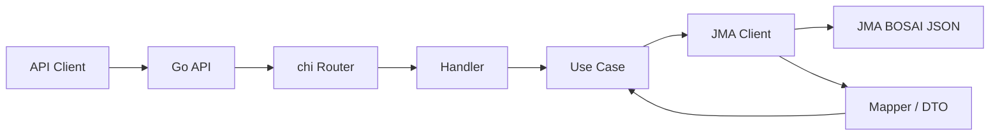

# JMA-JSON ラッパー API 設計書

## 目的

- 気象庁防災情報 JSON を、開発者が扱いやすい REST/OpenAPI インターフェースとして提供する。
- [README.md](../../README.md) に記載された初期スコープである `health check`、`forecast`、`area metadata`、`basic OpenAPI specification` を実装着手可能な粒度で定義する。
- 上流の JMA BOSAI JSON が予告なく変更される前提で、壊れにくい最小実装と段階的拡張の方針を定義する。

## 前提

- 本プロジェクトは気象庁とは無関係な非公式ラッパーである。
- 初期実装プラットフォームは Go とする。
- 初期段階ではシンプルさと保守しやすさを優先し、最小実装から段階的に拡張する。
- 上流の JMA BOSAI JSON は外部依存として扱い、仕様変更を常に想定する。
- 実装済みエンドポイントと OpenAPI ドキュメントは同時に整備する。
- OpenAPI 仕様を API コントラクトの正本として扱う。
- 設計と実装は同一リポジトリ内で管理する。

### 確認済みの事実

- JMA 公式エンドポイントとして、`https://www.jma.go.jp/bosai/common/const/area.json` と `https://www.jma.go.jp/bosai/forecast/data/forecast/130000.json` の JSON 応答を確認済みである。
- 上記 2 エンドポイントは、2026-03-12 JST 時点で `cache-control: max-age=60` を返している。
- Go 版 API サーバーは、標準 `net/http` を基盤とする構成を採用できる。
- `chi` は `net/http` ベースで利用できる軽量ルータであり、REST API 向けの構成に適している。
- `oapi-codegen` は OpenAPI 仕様から Go の型定義とサーバーインターフェースを生成できる。
- 初期リリースでは upstream の生 JSON を完全に再設計せず、薄い正規化に留める方針が適している。

### 決定事項

- 実装言語は Go を採用する。
- ルータは `chi` を採用する。
- OpenAPI は spec-first とし、仕様ファイルを正本とする。
- OpenAPI コード生成には `oapi-codegen` を採用する。
- HTTP 基盤は Go 標準の `net/http` を採用する。
- OpenAPI は `JSON` と `YAML` を併記して公開する。
- OpenAPI UI は同梱する。
- テストは `go test` を標準とする。
- lint は `golangci-lint` を採用する。
- `oapi-codegen` の生成対象は `types`、`server`、`spec` に分割し、生成コードは `internal/gen` 配下へ集約する。
- 初期デプロイ先は Cloud Run とする。
- 構造化ログには Go 標準の `log/slog` を採用する。
- OpenAPI UI には Scalar を採用し、公開パスは `/docs` とする。
- Cloud Run の最小インスタンス数は `0` とする。
- Cloud Run へのデプロイは Dockerfile ベースとする。
- `slog` の handler は標準実装をそのまま利用する。
- 初期リリースでは upstream の生 JSON を完全に再設計せず、薄い正規化に留める。

### 未確定事項

- Cloud Run の CPU / memory / concurrency の初期値
- Dockerfile のベースイメージとマルチステージ構成の詳細

## 要求整理

### 対象範囲

- API サーバーの責務定義
- 初期 3 API の HTTP 契約
- OpenAPI 公開方式
- 上流データ取得、変換、キャッシュ、エラー処理の方針
- 将来の warnings、earthquakes、tsunami などへ拡張可能な構造

### 非対象範囲

- 初期スコープ外 API の詳細設計
- DB 永続化
- 認証認可
- ジョブ基盤
- デプロイ基盤の確定
- SLA/SLO の確定

### 完了条件

- 初期スコープの各 API に対して、責務、入力、出力、エラー、上流依存が明記されている。
- 実装ディレクトリを起こせる程度にモジュール分割が定義されている。
- 上流変更耐性の考え方が API 層から独立して記述されている。
- OpenAPI の生成と公開方針が記述されている。

### 検証方法

- README の Goals、Development Policy、Scope と矛盾しないことを確認する。
- 初期スコープ 4 項目が設計書に漏れなく含まれることを確認する。
- 実装者が設計書だけで最初の scaffold と OpenAPI 雛形を作成できることを確認する。

## 設計方針

### 技術選定

- 実装言語は Go を採用する。
- ルータは `chi` を採用する。
- HTTP 基盤は Go 標準 `net/http` を採用する。
- OpenAPI は spec-first とし、`openapi/openapi.yaml` を正本とする。
- OpenAPI からの型定義およびサーバーインターフェース生成には `oapi-codegen` を採用する。
- OpenAPI は `openapi.json` と `openapi.yaml` を公開する。
- OpenAPI UI を同梱し、人間向けの参照導線を提供する。
- テストは `go test` を標準とする。
- lint は `golangci-lint` を採用する。
- `oapi-codegen` は `types.gen.go`、`server.gen.go`、`spec.gen.go` を生成し、`internal/gen` に配置する。
- 初期デプロイ先は Cloud Run とする。
- ロガーは Go 標準の `log/slog` を採用し、本番では JSON 出力を基本とする。
- OpenAPI UI には Scalar を採用し、`/docs` で公開する。
- Cloud Run の最小インスタンス数は `0` とする。
- デプロイは Dockerfile ベースで行う。
- `slog` は標準の JSON handler / text handler をそのまま利用する。
- 生成コードと実装コードは明確に分離する。

### `chi` 採用理由

- README の「シンプルさ」「最小実装」「長期保守性」に合う。
- 標準 `net/http` に近く、Go らしい構成を維持しやすい。
- REST API の責務分離とルーティング設計を過不足なく実現できる。
- `oapi-codegen` による生成コードとの接続がしやすい。

### API 設計原則

- 初期リリースでは薄いラッパーを優先し、上流データの意味を保ちながら利用しやすい形に整える。
- 上流 JSON は HTTP route 層に露出させず、`client` と `mapper` で吸収する。
- API の外部契約は OpenAPI と内部 DTO を正本とし、upstream 変更の影響を局所化する。
- API の URL とレスポンスは将来互換を意識し、初版から `/v1` を付与する。
- 共通エラー形式を最初から統一する。

### OpenAPI 方針

- OpenAPI 仕様ファイルを API コントラクトの正本とする。
- `oapi-codegen` により、型定義とサーバーインターフェースを生成する。
- 生成物はコミット対象に含める。
- 初期リリースでは `/openapi.json` と `/openapi.yaml` を公開する。
- 実装したエンドポイントだけを仕様に載せる。

## 構成案

### システム構成



### レイヤ構成

- `handlers`
  - HTTP ルーティングに紐づくハンドラ実装を担当する。
- `usecases`
  - API ごとの処理フローを担当する。
- `clients`
  - JMA 公式エンドポイントへのアクセスを担当する。
- `mappers`
  - 上流 JSON を内部 DTO に変換する。
- `gen`
  - `oapi-codegen` により生成された型定義、サーバーインターフェース、仕様埋め込みコードを保持する。
- `shared`
  - エラー、設定、`slog` ベースのロガー、共通型を保持する。

### ディレクトリ案

```text
.
├── docs/
│   └── designs/
│       └── jma-json-wrapper-api.md
├── openapi/
│   ├── openapi.json
│   └── openapi.yaml
├── cmd/
│   └── server/
│       └── main.go
├── internal/
│   ├── handlers/
│   │   ├── health.go
│   │   ├── areas.go
│   │   └── forecasts.go
│   ├── usecases/
│   │   ├── get_health.go
│   │   ├── list_areas.go
│   │   └── get_forecast.go
│   ├── clients/
│   │   └── jma_client.go
│   ├── mappers/
│   │   ├── area_mapper.go
│   │   └── forecast_mapper.go
│   ├── gen/
│   │   ├── server.gen.go
│   │   ├── spec.gen.go
│   │   └── types.gen.go
│   └── shared/
│       ├── config.go
│       ├── errors.go
│       └── logger.go
├── deploy/
│   └── cloudrun/
│       └── service.yaml
└── tests/
    ├── contract/
    ├── integration/
    └── fixtures/
```

### 開発ツール

- `oapi-codegen`
  - OpenAPI 仕様から型定義、サーバーインターフェース、仕様埋め込みコードを生成する。
- `Scalar`
  - OpenAPI UI を `/docs` で提供するために利用する。
- `go test`
  - unit test、integration test、fixture ベースの mapper test に利用する。
- `golangci-lint`
  - Go で一般的な静的検査の実行基盤として利用する。
- `log/slog`
  - 構造化ログ出力に利用する。ローカルでは text、本番では JSON を基本とする。

## API エンドポイント案

### `GET /healthz`

- 目的: アプリケーション自身の liveness を返す。
- 上流依存: なし。
- 正常応答:
  - `status`
  - `service`
  - `version`
  - `timestamp`
- 備考:
  - 初期リリースでは upstream の疎通を確認しない。
  - 将来 `GET /readyz` を追加可能な構造にする。

### `GET /v1/areas`

- 目的: 予報取得に必要な地域メタデータを返す。
- 上流依存: `area.json`
- 入力:
  - query `parent` optional
- `parent` の意味:
  - `offices` 集合に対し、`parent` が一致する要素のみを返す。
- 正常応答:
  - `items[]`
  - `items[].code`
  - `items[].name`
  - `items[].enName`
  - `items[].officeName`
  - `items[].parent`
  - `items[].children[]`
- 方針:
  - 初期リリースでは `area.json.offices` のみを返す。
  - `parent` は `offices.parent` に対するフィルタとして扱う。
- 補足:
  - README の `Area metadata endpoint` を list と detail に分解したものであり、初期スコープ内の詳細化として扱う。
  - 一覧検索と単一コード解決ではレスポンスサイズと利用者の呼び分けが異なるため、list と detail を分離する。

### `GET /v1/areas/{areaCode}`

- 目的: 単一地域コードの詳細を返す。
- 上流依存: `area.json`
- 入力:
  - path `areaCode`
- 正常応答:
  - `code`
  - `name`
  - `enName`
  - `officeName`
  - `parent`
  - `children[]`
- 異常応答:
  - 存在しないコードは `404`
- 補足:
  - `GET /v1/areas` の detail 表現として扱い、新たなスコープ追加とはみなさない。
  - 初期リリースでは `area.json.offices` のみを探索対象とする。

### `GET /v1/forecasts/{officeCode}`

- 目的: 指定地域の forecast を利用しやすい形で返す。
- 上流依存: `forecast/{officeCode}.json`
- 入力:
  - path `officeCode`
- `officeCode` の定義:
  - `area.json.offices` のキーを正とする。
- 初期リリースで受け付ける例:
  - `130000`
- 正常応答:
  - `office`
  - `publishingOffice`
  - `reportDatetime`
  - `weatherAreas[]`
  - `weatherAreas[].code`
  - `weatherAreas[].name`
  - `weatherAreas[].timeSeries[]`
  - `temperatureAreas[]`
  - `temperatureAreas[].code`
  - `temperatureAreas[].name`
  - `temperatureAreas[].timeSeries[]`
- 方針:
  - 初期リリースでは 1 系統の forecast JSON のみ対象とする。
  - `weather/pops` 系と `temps` 系で area code が異なるため、別セクションで返す。
  - 上流の全項目を露出せず、初版では頻出項目を優先する。
  - `forecast/130000.json` の第2要素に含まれる averages と信頼度系データは初期リリースでは返さない。

### Forecast の初期マッピング

初期リリースでは `forecast/{officeCode}.json` の先頭要素のみを対象とし、第2要素の `precipAverage`、`tempAverage`、`reliabilities`、`tempsMax*`、`tempsMin*` は返却契約に含めない。先頭要素の `timeSeries[0]` と `timeSeries[1]` は同一の area code 体系であるため `weatherAreas` に統合し、`timeSeries[2]` は別の area code 体系であるため `temperatureAreas` として独立させる。

| API 項目                                  | upstream 元                            | 初期リリースの扱い |
| ----------------------------------------- | -------------------------------------- | ------------------ |
| `office.code`                             | path `officeCode`                      | 採用               |
| `office.name`                             | `area.json.offices[officeCode].name`   | 採用               |
| `publishingOffice`                        | `publishingOffice`                     | 採用               |
| `reportDatetime`                          | `reportDatetime`                       | 採用               |
| `weatherAreas[].code`                     | `timeSeries[0].areas[].area.code`      | 採用               |
| `weatherAreas[].name`                     | `timeSeries[0].areas[].area.name`      | 採用               |
| `weatherAreas[].timeSeries[].weatherCode` | `timeSeries[0].areas[].weatherCodes[]` | 採用               |
| `weatherAreas[].timeSeries[].weather`     | `timeSeries[0].areas[].weathers[]`     | 採用               |
| `weatherAreas[].timeSeries[].wind`        | `timeSeries[0].areas[].winds[]`        | 採用               |
| `weatherAreas[].timeSeries[].wave`        | `timeSeries[0].areas[].waves[]`        | 採用               |
| `weatherAreas[].timeSeries[].pop`         | `timeSeries[1].areas[].pops[]`         | 採用               |
| `temperatureAreas[].code`                 | `timeSeries[2].areas[].area.code`      | 採用               |
| `temperatureAreas[].name`                 | `timeSeries[2].areas[].area.name`      | 採用               |
| `temperatureAreas[].timeSeries[].temp`    | `timeSeries[2].areas[].temps[]`        | 採用               |
| `precipAverage`                           | 先頭要素以外                           | 不採用             |
| `tempAverage`                             | 先頭要素以外                           | 不採用             |
| `reliabilities`                           | 先頭要素以外                           | 不採用             |
| `tempsMax* / tempsMin*`                   | 先頭要素以外                           | 不採用             |

### Forecast レスポンスの最小形

```json
{
  "office": {
    "code": "130000",
    "name": "東京都"
  },
  "publishingOffice": "気象庁",
  "reportDatetime": "2026-03-11T22:00:00+09:00",
  "weatherAreas": [
    {
      "code": "130010",
      "name": "東京地方",
      "timeSeries": [
        {
          "time": "2026-03-12T00:00:00+09:00",
          "weatherCode": "101",
          "weather": "晴れ 時々 くもり",
          "wind": "北の風",
          "wave": "0.5メートル",
          "pop": null
        }
      ]
    }
  ],
  "temperatureAreas": [
    {
      "code": "44132",
      "name": "東京",
      "timeSeries": [
        {
          "time": "2026-03-12T00:00:00+09:00",
          "temp": "11"
        }
      ]
    }
  ]
}
```

## データフロー

### Area metadata

1. `GET /v1/areas` を受信する。
2. `AreaUseCase` が `JmaClient` を呼び出す。
3. `JmaClient` が `area.json` を取得する。
4. `AreaMapper` が内部 DTO へ変換する。
5. DTO を OpenAPI 契約に従って返却する。

### Forecast

1. `GET /v1/forecasts/{officeCode}` を受信する。
2. `ForecastUseCase` が `officeCode` を検証する。
3. `officeCode` が `area.json.offices` に存在することを確認する。
4. `JmaClient` が `forecast/{officeCode}.json` を取得する。
5. `ForecastMapper` が `weather/pops` 系を `weatherAreas` へ、`temps` 系を `temperatureAreas` へ変換する。
6. DTO を OpenAPI 契約に従って返却する。

## upstream 依存と変更耐性

### upstream 依存の閉じ込め

- upstream URL の組み立ては `JmaClient` のみが担当する。
- upstream JSON の構造解釈は `mappers` に限定する。
- handler と usecase は upstream の生構造を知らない。

### 変更耐性の具体策

- mapper テスト用の fixture を保持し、上流構造の差分検知を容易にする。
- 変換に失敗した場合は、原因をログに残したうえで共通エラーを返す。
- 互換を壊す API 変更は `/v2` 以降で扱い、`/v1` では内部変換で吸収する。

### キャッシュ方針

- 初期リリースではメモリキャッシュのみを採用する。
- `area.json` は読み取り専用メタデータとして扱い、upstream の `max-age` を上限としてキャッシュする。
- `forecast` は最新性を優先し、初期リリースでは積極的なキャッシュを行わない。

## エラーハンドリング方針

### HTTP ステータス

- `400`: パラメータ不正
- `404`: 地域コード未存在
- `502`: upstream 応答異常
- `503`: upstream タイムアウトまたは一時利用不可
- `500`: 変換失敗または内部異常

### 共通エラー形式

```json
{
  "error": {
    "code": "UPSTREAM_UNAVAILABLE",
    "message": "Failed to fetch forecast from upstream.",
    "details": {
      "officeCode": "130000"
    },
    "requestId": "req-123"
  }
}
```

### ログ方針

- requestId を全リクエストへ付与する。
- upstream 呼び出しの URL、HTTP status、所要時間を記録する。
- 変換失敗時はフィールド欠損箇所を記録する。
- 機微情報はログに含めない。
- `log/slog` を利用し、本番は JSON handler、ローカル開発は text handler を使い分ける。
- `slog` の handler は標準実装をそのまま利用し、独自ラッパーは導入しない。
- 最低限の標準フィールドとして `request_id`、`path`、`method`、`status`、`latency_ms`、`upstream_url`、`upstream_status` を出力する。

## OpenAPI 仕様方針

- `openapi/openapi.yaml` を正本とする。
- OpenAPI には各エンドポイントの summary、description、params、responses、error schema を定義する。
- `oapi-codegen` により、サーバーインターフェースと型定義を生成する。
- `oapi-codegen` の生成物は `internal/gen/types.gen.go`、`internal/gen/server.gen.go`、`internal/gen/spec.gen.go` に分離する。
- 手書きコードからは `internal/gen` を参照し、生成ファイルは直接編集しない。
- `servers` にはローカル開発用 URL と公開用 URL を切り替え可能な形で記述する。
- `components.schemas` に共通 error model を置く。
- OpenAPI UI は初期必須要件に含め、Scalar により `/docs` で提供する。

## 非機能要件

### パフォーマンス

- 初期リリースでは高負荷最適化を目的にしない。
- area metadata はキャッシュにより無駄な upstream アクセスを抑える。

### デプロイ

- 初期デプロイ先は Cloud Run とする。
- stateless なコンテナ型 HTTP サービスとして構成する。
- Cloud Run の autoscaling と scale-to-zero を前提に、永続状態を持たない設計を維持する。
- 初期リリースの Cloud Run 最小インスタンス数は `0` とする。
- デプロイは Dockerfile ベースで行う。

### 可観測性

- アクセスログ
- upstream 依存ログ
- エラーログ
- 将来メトリクス導入可能な構造

### 保守性

- エンドポイントごとに `handler/usecase/mapper` を揃える。
- スコープ外の汎化を避ける。
- 仕様変更は OpenAPI とセットで更新する。
- 生成コードを直接編集しない。

## リスクと対策

### upstream JSON 構造変更

- リスク:
  - mapper が壊れ、`/v1` の応答生成に失敗する。
- 対策:
  - mapper を専用層へ隔離する。
  - fixture ベースのマッピングテストを導入する。

### 正規化しすぎによる将来互換低下

- リスク:
  - API 利用者にとって便利でも、upstream 変更時の吸収コストが高くなる。
- 対策:
  - 初期リリースは薄い正規化に留める。
  - 追加変換は version を分けて導入する。

### forecast 対象の拡大による設計肥大化

- リスク:
  - 概況予報、警報、地震などを初版に混ぜると構造が不必要に複雑になる。
- 対策:
  - 初期リリースは forecast 1 系統に限定する。
  - 追加対象は別 ADR または別設計章で扱う。
